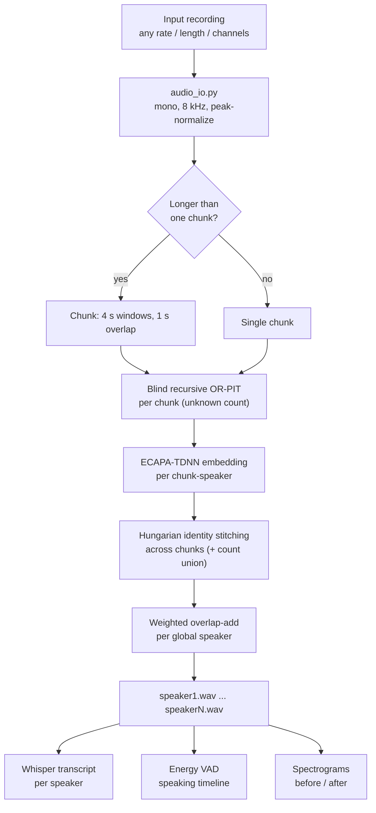
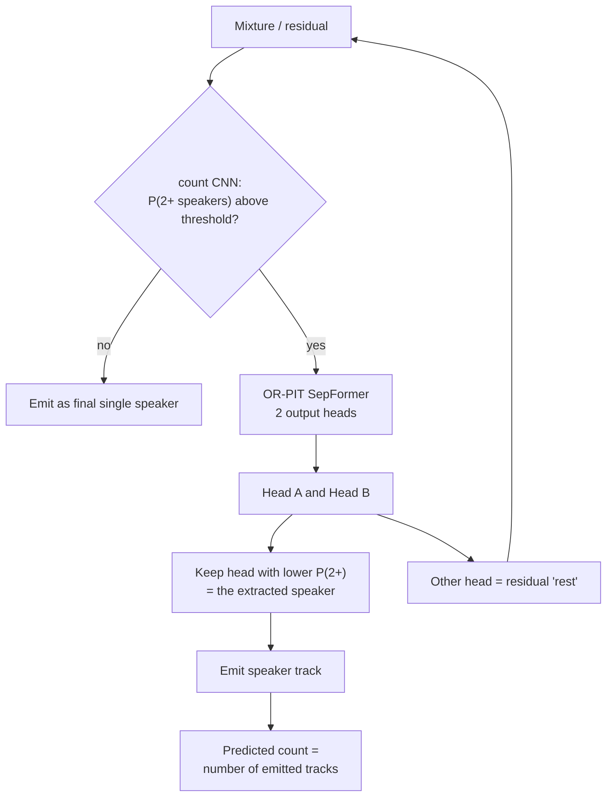
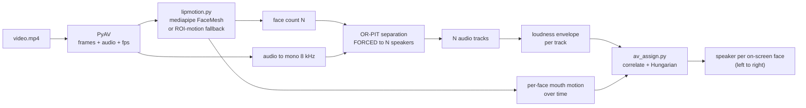
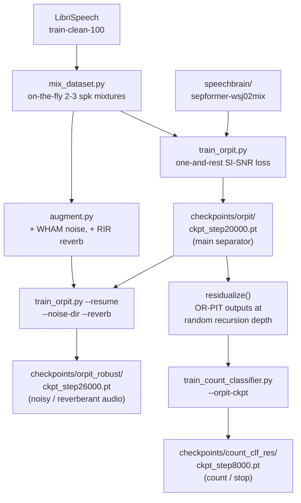

# VoxSplit — Architecture

How the system fits together. Results are in [REPORT.md](REPORT.md), phase-by-phase
engineering history in [PLAN.md](PLAN.md).

---

## 1. System overview (inference)

One model separates a recording with an **unknown** number of speakers into one
clean track per speaker, then the addons annotate it.



---

## 2. Blind recursion — the unknown-count core

OR-PIT gives a 2-head model: **one speaker** + **the rest**. Recursing on the
residual handles any count; a small CNN decides head roles and when to stop.
Recursion depth **is** the predicted speaker count.



**Force-count mode** skips the stop decision and runs exactly `N-1` passes
(the classifier is still used to pick which head is the single speaker). This is
the reliable route when the count is known — e.g. the hard 4-speaker level.

---

## 3. Audio-visual mode

The video **drives** the audio separator: faces give the **count**, lip motion
gives each track's **identity**.



Not used: AV *masking* models (RTFS-Net / IIANet / CTCNet) that fuse mouth crops
into the network — they need an external repo + video training data. See
[src/av/README.md](src/av/README.md).

---

## 4. How the models were trained



Key insight: the count classifier **must** be trained on the separator's own
artifact-laden residuals at multiple depths — a clean-trained one fails
(blind count accuracy 0.25 → 0.71).

---

## 5. Models and components

| Role | Model / method | Where |
|---|---|---|
| Separator | OR-PIT **SepFormer**, 2 heads, recursive | `checkpoints/orpit/ckpt_step20000.pt` (warm-start `speechbrain/sepformer-wsj02mix`) |
| Robust separator | same, noise/reverb fine-tune | `checkpoints/orpit_robust/ckpt_step26000.pt` |
| Count / stop | **SpeakerCountCNN** (log-mel CNN) | `checkpoints/count_clf_res/ckpt_step8000.pt` |
| Cross-chunk identity | **ECAPA-TDNN** | `speechbrain/spkrec-ecapa-voxceleb` → `pretrained_models/ecapa-dl` |
| Transcription | **faster-whisper** (`base.en`) | auto-downloaded |
| Face landmarks | **mediapipe FaceMesh** (+ ROI fallback) | pip `mediapipe` |
| Assignment / stitching | Hungarian on cosine / correlation | `scipy.optimize.linear_sum_assignment` |
| Fixed-N baselines | uPIT SepFormer 4- and 5-speaker | `checkpoints/pit4_libri`, `pit5_libri` |

---

## 6. Repository layout

```
src/
  mixing/      make_mixture.py           mixture generation (2..N speakers)
  data/        build_eval_set.py         frozen eval manifest (committed)
               realize_eval_set.py       manifest -> audio (reproducible)
               make_conditions.py        noise / reverb variants
  models/      tfgridnet.py              from-scratch TF baseline
               count_classifier.py       count / stop CNN
  train/       train_orpit.py            OR-PIT fine-tune (+ --resume, augment)
               train_pit.py              fixed-N uPIT (+ masknet head expansion)
               train_count_classifier.py residual-domain count classifier
               augment.py                WHAM noise + RIR reverb
               orpit_loss.py, pit_loss.py, mix_dataset.py, wandb_logger.py
  inference/   separate_unknown.py       single file, unknown count
               separate_longform.py      long audio + ECAPA stitching (main CLI)
               separate_recursive_blind.py  blind recursion core
               transcribe.py, timeline.py, audio_io.py, enhance.py
  av/          separate_av.py            audio-visual entry point
               lipmotion.py, av_assign.py, make_synth_av.py
  eval/        metrics.py, evaluate_set.py   SI-SDR / PESQ / STOI + PIT matching
demo/          app.py (Gradio: Audio + Video tabs), pipeline.py
experiments/   *.csv logs, make_report.py, RESULTS.md, plots/
data/          manifests committed; audio gitignored (regenerate from manifest)
checkpoints/   trained weights (gitignored — see README setup)
```

---

## 7. Design decisions worth knowing

- **Audio-only core.** The evaluation inputs are audio, and modern audio-only
  separators beat the 2018 audio-visual *Looking to Listen* baseline. Video is an
  addon that resolves count and identity.
- **Recursion over fixed-N.** Dedicated fixed-N models score higher per level,
  but need the count known and one model per level. Recursion trades some quality
  for covering any/unknown count with a single model.
- **Manifest-first data.** The frozen eval set is a committed JSON manifest of
  source paths + exact gains; audio regenerates byte-identically, so nothing
  large is in git.
- **8 kHz, 3 s segments.** Fits the 16 GB GPU and matches the pretrained
  SepFormer domain; chunking at inference stays near 4 s to stay in-domain.
