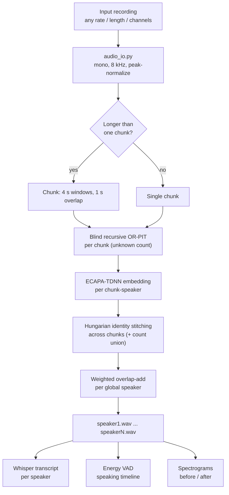
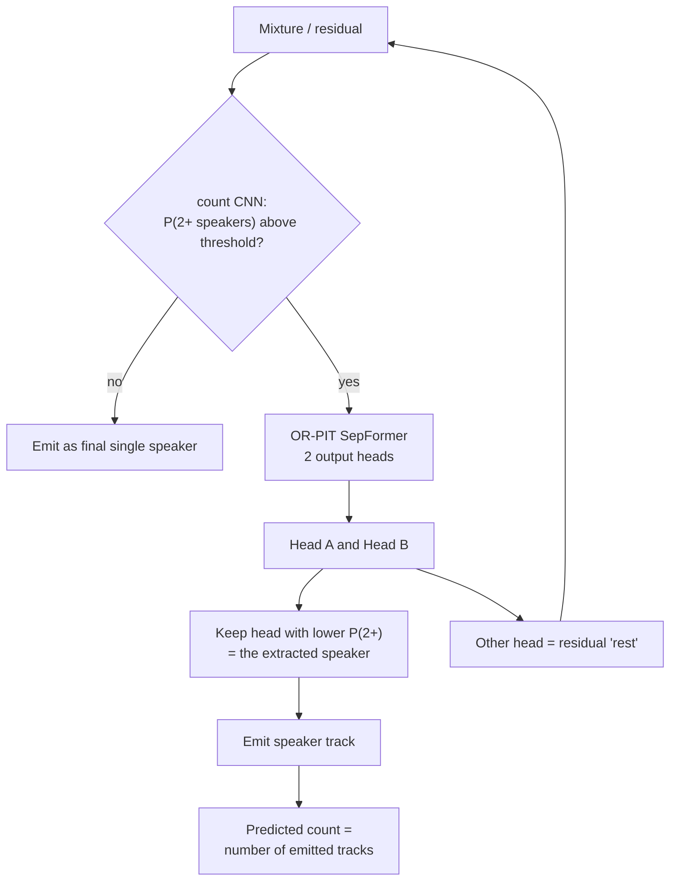
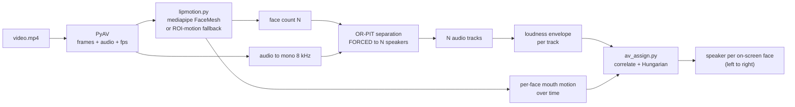
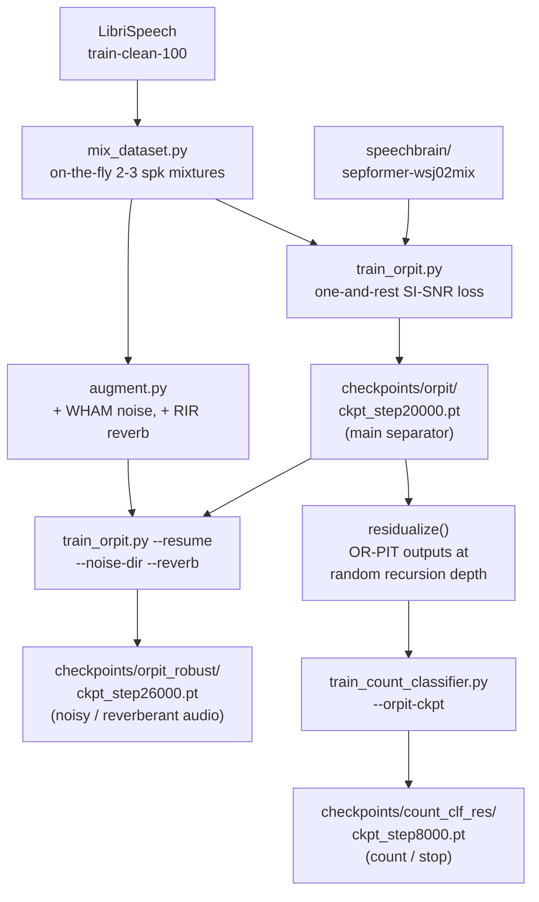

# VoxSplit — Architecture

How the system fits together. Results are in [REPORT.md](REPORT.md), phase-by-phase
engineering history in [PLAN.md](PLAN.md).

---

## 1. System overview (inference)

One model separates a recording with an **unknown** number of speakers into one
clean track per speaker, then the addons annotate it.



---

## 2. Blind recursion — the unknown-count core

OR-PIT gives a 2-head model: **one speaker** + **the rest**. Recursing on the
residual handles any count; a small CNN decides head roles and when to stop.
Recursion depth **is** the predicted speaker count.



**Force-count mode** skips the stop decision and runs exactly `N-1` passes
(the classifier is still used to pick which head is the single speaker). This is
the reliable route when the count is known — e.g. the hard 4-speaker level.

---

## 3. Audio-visual mode

The video **drives** the audio separator: faces give the **count**, lip motion
gives each track's **identity**.



Not used: AV *masking* models (RTFS-Net / IIANet / CTCNet) that fuse mouth crops
into the network — they need an external repo + video training data. See
[src/av/README.md](src/av/README.md).

---

## 4. How the models were trained



Key insight: the count classifier **must** be trained on the separator's own
artifact-laden residuals at multiple depths — a clean-trained one fails
(blind count accuracy 0.25 → 0.71).

---

## 5. Models and components

| Role | Model / method | Where |
|---|---|---|
| Separator | OR-PIT **SepFormer**, 2 heads, recursive | `checkpoints/orpit/ckpt_step20000.pt` (warm-start `speechbrain/sepformer-wsj02mix`) |
| Robust separator | same, noise/reverb fine-tune | `checkpoints/orpit_robust/ckpt_step26000.pt` |
| Count / stop | **SpeakerCountCNN** (log-mel CNN) | `checkpoints/count_clf_res/ckpt_step8000.pt` |
| Cross-chunk identity | **ECAPA-TDNN** | `speechbrain/spkrec-ecapa-voxceleb` → `pretrained_models/ecapa-dl` |
| Transcription | **faster-whisper** (`base.en`) | auto-downloaded |
| Face landmarks | **mediapipe FaceMesh** (+ ROI fallback) | pip `mediapipe` |
| Assignment / stitching | Hungarian on cosine / correlation | `scipy.optimize.linear_sum_assignment` |
| Fixed-N baselines | uPIT SepFormer 4- and 5-speaker | `checkpoints/pit4_libri`, `pit5_libri` |

---

## 6. Repository layout

Entry points marked ★. Everything under `checkpoints/`, `pretrained_models/`,
and the raw audio in `data/` is gitignored (see README setup).

```
README.md  ARCHITECTURE.md  REPORT.md  PLAN.md      docs (start here)
requirements.txt

demo/
  app.py                       ★ Gradio web demo (Audio + Video tabs)
  pipeline.py                  ★ shared end-to-end Pipeline (also a CLI)

src/
  check_env.py                 ★ environment + GPU sanity check
  mixing/
    make_mixture.py            mixture generation (2..N speakers), source scanning
  data/
    build_eval_set.py          frozen eval manifest (JSON, committed)
    realize_eval_set.py        manifest -> byte-identical audio
    make_conditions.py         WHAM-noise / reverb manifest variants
  models/
    count_classifier.py        SpeakerCountCNN — count / stop (P(2+ speakers))
    tfgridnet.py               compact TF-GridNet (from-scratch baseline)
  train/
    train_orpit.py             OR-PIT fine-tune (--resume, --noise-dir/--reverb)
    train_pit.py               fixed-N uPIT + masknet head expansion (3->N)
    train_count_classifier.py  count classifier (--orpit-ckpt = residual domain)
    train_convtasnet.py        Conv-TasNet from scratch (learning baseline)
    train_tfgridnet.py         TF-GridNet from scratch (TF-domain baseline)
    mix_dataset.py             on-the-fly mixtures
    augment.py                 WHAM noise + pooled-RIR reverb
    orpit_loss.py              one-and-rest SI-SNR
    pit_loss.py                utterance-level PIT
    wandb_logger.py            optional W&B (off by default)
  inference/
    separate_longform.py       ★ MAIN CLI — long audio + ECAPA stitching
    separate_unknown.py        ★ single file, unknown count
    separate_recursive_blind.py  blind recursion core (+ force_count)
    audio_io.py                mono / 8 kHz / peak-normalize
    transcribe.py              per-speaker Whisper (faster-whisper)
    timeline.py                speaking timeline via energy VAD
    enhance.py                 MetricGAN+ post-filter (ablation: it hurts)
    separate.py                pretrained SepFormer, single file
    separate_set.py            batch eval-set inference (pretrained)
    separate_orpit_set.py      batch OR-PIT (2-spk direct)
    separate_orpit_recursive_set.py  batch recursion, oracle count
    separate_finetuned_set.py  batch fixed-N (sepformer / convtasnet)
    separate_tfgridnet_set.py  batch TF-GridNet
    separate_maxn_set.py       max-N + silence detection (unknown-count baseline)
    separate_mossformer2.py    MossFormer2 via the separate clearvoice env
  av/                          ★ audio-visual mode
    separate_av.py             ★ video -> count + separate + assign
    lipmotion.py               mediapipe FaceMesh / ROI-motion fallback
    av_assign.py               envelope <-> lip-motion correlation + Hungarian
    make_synth_av.py           renders a synthetic talking-face test clip
    README.md                  AV design + how to finish full AV masking
  eval/
    metrics.py                 SI-SDR, PESQ, STOI, best-permutation matching
    evaluate_set.py            batch scoring, aggregated per speaker count
    evaluate.py                single-mixture scoring

experiments/
  make_report.py               ★ regenerates RESULTS.md + plots from the CSVs
  RESULTS.md  plots/           auto-generated tables and figures
  eval_set_results.csv         every model x level result (source of truth)
  eval_set_conditions.csv      degradation conditions
  phase1_*.csv                 early pretrained-baseline logs
  phase4_count_predictions.csv per-mixture blind count predictions

scripts/                       phase smoke tests
data/                          manifests committed; audio gitignored
checkpoints/                   trained weights — gitignored, see README setup
pretrained_models/             downloaded weights (ECAPA, SepFormer) — gitignored
```

Which files map to which diagram above:
- **§1 overview** → `audio_io.py`, `separate_longform.py`, `separate_recursive_blind.py`, `transcribe.py`, `timeline.py`
- **§2 recursion** → `separate_recursive_blind.py`, `count_classifier.py`, `train_orpit.py`
- **§3 audio-visual** → `src/av/*`
- **§4 training** → `src/train/*`, `src/models/*`

---

## 7. Design decisions worth knowing

- **Audio-only core.** The evaluation inputs are audio, and modern audio-only
  separators beat the 2018 audio-visual *Looking to Listen* baseline. Video is an
  addon that resolves count and identity.
- **Recursion over fixed-N.** Dedicated fixed-N models score higher per level,
  but need the count known and one model per level. Recursion trades some quality
  for covering any/unknown count with a single model.
- **Manifest-first data.** The frozen eval set is a committed JSON manifest of
  source paths + exact gains; audio regenerates byte-identically, so nothing
  large is in git.
- **8 kHz, 3 s segments.** Fits the 16 GB GPU and matches the pretrained
  SepFormer domain; chunking at inference stays near 4 s to stay in-domain.
