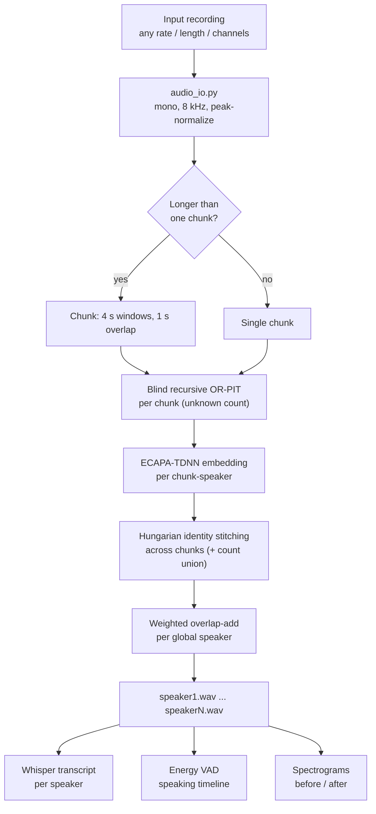

# VoxSplit, Multi-Speaker Speech Separation

Take an audio recording where **3 or more people speak at the same time** and return a
clean, separate audio track for **each speaker**. (The "cocktail party problem.")

Summer project inspired by Google's [*Looking to Listen*](https://looking-to-listen.github.io/),
but built **audio-only** at its core with modern (2024 to 2026) separation models,
since the evaluation is on audio inputs — with an audio-visual mode as a bonus.

**Jump to:** [Architecture](#architecture) · [Setup on a new device](#setup-on-a-new-device-for-teammates) ·
[Usage](#usage) · [Results](#results-headline) · [ARCHITECTURE.md](ARCHITECTURE.md) ·
[REPORT.md](REPORT.md) · [PLAN.md](PLAN.md)

## Status
- [x] Phase 0, environment and GPU verified
- [x] Phase 1, pretrained baselines compared. Best 3-spk: SepFormer libri3mix (mean SI-SDRi about 18.6 dB). Best 2-spk: MossFormer2 (about 20.2 dB). See PLAN.md for the table
- [x] Phase 2, frozen eval set (2 to 5 spk, 80 mixtures) plus WHAM-noise, reverb, and 16 kHz variants, all reproducible from committed manifests
- [x] Phase 3, OR-PIT fine-tuning: converged 20000-step run. One 2-head model separates 2 to 5 speakers, 2-spk direct at 19.25 dB SI-SDRi (beats the 17.35 dB baseline) and 3/4/5-spk via recursion at 15.62 / 8.50 / 5.96 dB (oracle head selection; blind selection is Phase 4). Benchmarked against fixed-N uPIT baselines (4-spk 15.16, 5-spk 11.01 dB, both trained via masknet head expansion) and a from-scratch TF-GridNet (3-spk, learning-scale). Optional W&B logging wired in (off by default). See PLAN.md
- [x] Phase 4, unknown speaker count: blind recursive OR-PIT driven by a count/stop classifier. One model, no count supplied: 0.71 count accuracy on the frozen 2-5 set, and separation matches the oracle recursion when the count is right. The stop classifier only worked once trained on the OR-PIT model's own residuals (naive clean-trained version scored 0.25). Entry point `src/inference/separate_unknown.py`. See PLAN.md
- [x] Phase 5, real-world robustness: input normalization, long-audio chunking with ECAPA identity stitching (Hungarian one-to-one matching across chunks), and a noise/reverb-augmented fine-tune. Robustness fine-tune lifts the degraded 2-spk score from 6.68 to 11.44 dB (noise) and 4.04 to 7.06 dB (reverb) with clean retained (19.02). End-to-end CLI `src/inference/separate_longform.py` handles arbitrary recordings (any rate/length, unknown count). ECAPA stitching is reliable for distinct voices, weaker for similar ones. See PLAN.md
- [x] Phase 6, addons: Gradio web demo (`demo/app.py`) with per-speaker players, before/after spectrograms, Whisper transcripts, and a speaking timeline; auto-detected count. Per-speaker transcription via faster-whisper (`src/inference/transcribe.py`); diarization timelines from our own separated tracks via energy VAD (`src/inference/timeline.py`, no gated pyannote). **Audio-visual mode** (`src/av/`): the video gives the speaker count and each track is matched to its on-screen speaker by lip-motion↔audio correlation; validated on a synthetic talking-face clip (correct face assignment at ~19.7 dB). See PLAN.md
- [x] Phase 7, evaluation and report: full metric sweep, ablations, and failure analysis consolidated in **[REPORT.md](REPORT.md)** and auto-generated **[experiments/RESULTS.md](experiments/RESULTS.md)** (regenerate with `python experiments/make_report.py`). Plots in `experiments/plots/`

## Results (headline)

Frozen eval set (LibriSpeech test-clean, 20 mixtures/level, 8 kHz, SI-SDRi dB):

| Level | Best fixed-N | OR-PIT blind (unknown count) | Blind count acc |
|---|---|---|---|
| 2 spk | 19.25 | 19.25 | 1.00 |
| 3 spk | 19.33 | 16.09 | 0.70 |
| 4 spk | 15.16 | 9.09 | 0.40 |
| 5 spk | 11.01 | 7.23 | 0.75 |

One model separates 2–5 speakers with **no count supplied** (0.71 overall count
accuracy). Robustness fine-tune: noise 6.68→11.44, reverb 4.04→7.06 dB. Full
tables, ablations, failure analysis, and plots in [REPORT.md](REPORT.md).

## Architecture

One model separates a recording with an **unknown** number of speakers into one
clean track per speaker, then the addons annotate it. Full diagrams (blind
recursion, audio-visual mode, training) in **[ARCHITECTURE.md](ARCHITECTURE.md)**.



---

# Setup on a new device (for teammates)

Windows + PowerShell shown; Linux/macOS is the same minus the conda-init note.

### Prerequisites
- **Miniconda/Anaconda** and **git**.
- **NVIDIA GPU + driver** for speed (CPU works but is slow).
- Disk: ~1 GB (code + models) — more only if you regenerate datasets.

### Step 1 — Clone
```powershell
git clone https://github.com/RishiiGamer2201/voxsplit.git
cd voxsplit
```

### Step 2 — Create and activate the environment
```powershell
conda create -y -n voxsplit python=3.10
conda init powershell      # ONCE per machine, then CLOSE and REOPEN PowerShell
conda activate voxsplit
```
> **Check the prompt shows `(voxsplit)`.** If it doesn't, `python`/`pip` will
> silently hit your system Python and nothing will work. Verify with:
> `python -c "import sys; print(sys.executable)"` → must be under
> `miniconda3\envs\voxsplit`.

### Step 3 — Install PyTorch (match YOUR GPU)
```powershell
# Blackwell (RTX 50xx) needs the cu128 index:
pip install torch torchaudio --index-url https://download.pytorch.org/whl/cu128
```
Older GPUs: use the matching index from https://pytorch.org (e.g. `cu124`).
CPU-only: `pip install torch torchaudio`.

### Step 4 — Install ffmpeg + the Python deps
```powershell
conda install -y -c conda-forge ffmpeg sox
pip install -r requirements.txt
```

### Step 5 — Verify the environment
```powershell
python src/check_env.py
```
Expect `CUDA avail : True`, your GPU name, and `matmul test : OK`.

### Step 6 — Get the trained checkpoints (NOT in git)
Weights are too large for the repo (`checkpoints/` is gitignored). Copy these
from the training machine / shared drive, preserving paths:

| File | Size | Needed for |
|---|---|---|
| `checkpoints/orpit/ckpt_step20000.pt` | 305 MB | **required** — main separator |
| `checkpoints/count_clf_res/ckpt_step8000.pt` | 354 KB | **required** — speaker count / stop |
| `checkpoints/orpit_robust/ckpt_step26000.pt` | 305 MB | optional — noisy/reverberant audio |

```powershell
# after copying, confirm:
Get-ChildItem checkpoints\orpit\ckpt_step20000.pt, checkpoints\count_clf_res\ckpt_step8000.pt
```
No checkpoints? You can retrain (needs LibriSpeech + hours of GPU) — see
[PLAN.md](PLAN.md) Phase 3/4 for the exact commands.

### Step 7 — Pre-fetch the ECAPA speaker model (one-time)
SpeechBrain's own fetch hangs on Windows, so download it directly:
```powershell
python -c "from huggingface_hub import snapshot_download; snapshot_download('speechbrain/spkrec-ecapa-voxceleb', local_dir='pretrained_models/ecapa-dl')"
```
The SepFormer weights and Whisper model download automatically on first run.

### Step 8 — Run it
```powershell
python demo/app.py            # then open http://localhost:7860
```
First run takes ~30-60 s to load models. Done.

---

## Usage

### Web demo
```powershell
python demo/app.py                    # http://localhost:7860
python demo/app.py --port 7861 --share
```
Two tabs:
- **Audio** — upload a recording. Auto-detects the count; "Speaker count" forces
  an exact count; "Split sensitivity" nudges the auto count.
- **Video (audio-visual)** — upload a video; on-screen faces set the count and
  lip motion assigns each track to its speaker.

Per speaker: player, spectrogram, transcript, plus a speaking timeline.

### Command line
```powershell
# short clip, unknown count
python src/inference/separate_unknown.py mix.wav `
  --orpit-ckpt checkpoints/orpit/ckpt_step20000.pt `
  --clf-ckpt checkpoints/count_clf_res/ckpt_step8000.pt --out-dir out/

# long / real recording (chunking + ECAPA stitching); robust model for noisy audio
python src/inference/separate_longform.py recording.wav `
  --orpit-ckpt checkpoints/orpit_robust/ckpt_step26000.pt `
  --clf-ckpt checkpoints/count_clf_res/ckpt_step8000.pt --out-dir out/

# audio-visual: video drives count + identity
python src/av/make_synth_av.py --out scratch/av_test.mp4      # test clip
python src/av/separate_av.py scratch/av_test.mp4 --out-dir out/av --num-faces 2

# regenerate result tables + plots
python experiments/make_report.py
```
Tip: the CLI loads, runs, and exits (frees VRAM) — prefer it over leaving the web
app open if the GPU is busy training.

### Optional — reproduce the eval set
```powershell
python data/download_librispeech.py                 # test-clean
python src/data/realize_eval_set.py --manifest data/eval_manifest.json `
  --librispeech-root data/LibriSpeech --out-dir data/eval_set
```
Audio is gitignored; the committed manifest regenerates it byte-identically.

## Troubleshooting
| Symptom | Fix |
|---|---|
| `No module named gradio` / `torch ...+cpu` | You're on system Python. `conda activate voxsplit`, re-check `sys.executable`. |
| `conda activate` does nothing | `conda init powershell`, reopen the terminal. |
| ECAPA/model download hangs | Run the Step 7 pre-fetch. |
| `FileNotFoundError: ckpt_step20000.pt` | Checkpoints missing — Step 6. |
| Demo miscounts speakers | Use "Speaker count" to force it, or the sensitivity slider. 4-speaker is the known weak level. |

## Machine used for training
NVIDIA RTX 5070 Ti (16 GB, Blackwell/sm_120), Intel Core Ultra 7 265K, 32 GB RAM, Windows 11.

## Repository layout
See [ARCHITECTURE.md](ARCHITECTURE.md) for the annotated tree and design notes.
```
src/mixing/      mixture generation (2..N speakers)
src/data/        eval-set manifests + realization + noise/reverb variants
src/models/      count classifier, TF-GridNet baseline
src/train/       OR-PIT / uPIT / classifier training, augmentation
src/inference/   separation CLIs, chunking + ECAPA stitching, transcribe, timeline
src/av/          audio-visual mode (lip motion, assignment, synthetic test clip)
src/eval/        SI-SDR / PESQ / STOI + permutation matching
demo/            Gradio app (Audio + Video tabs) and the shared Pipeline
experiments/     CSV logs, make_report.py, RESULTS.md, plots/
data/            manifests committed; audio gitignored (regenerate from manifest)
checkpoints/     trained weights (gitignored — see Setup Step 6)
```

## Docs
- **[ARCHITECTURE.md](ARCHITECTURE.md)** — diagrams, models, design decisions
- **[REPORT.md](REPORT.md)** — method, results, ablations, failure analysis
- **[experiments/RESULTS.md](experiments/RESULTS.md)** — auto-generated tables + plots
- **[PLAN.md](PLAN.md)** — phase-by-phase engineering history
- **[src/av/README.md](src/av/README.md)** — audio-visual mode details
