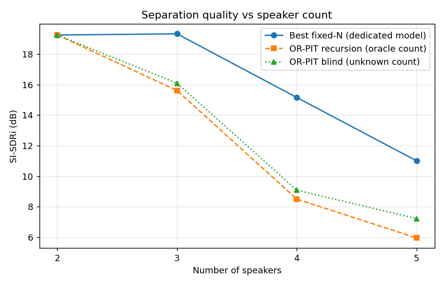
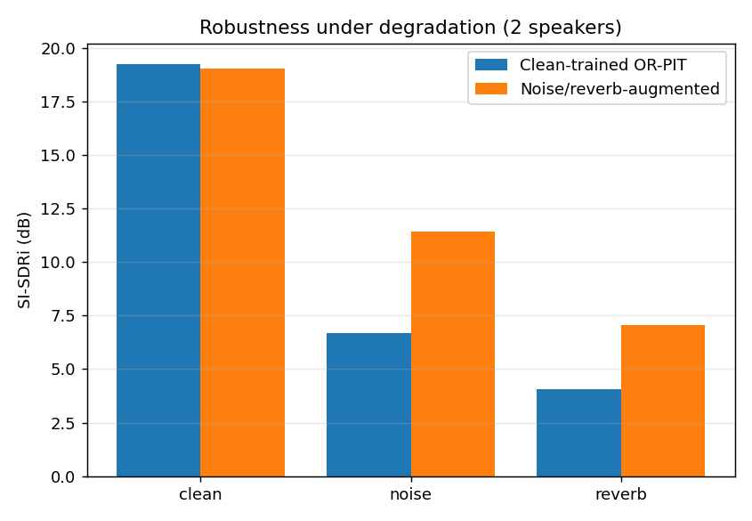
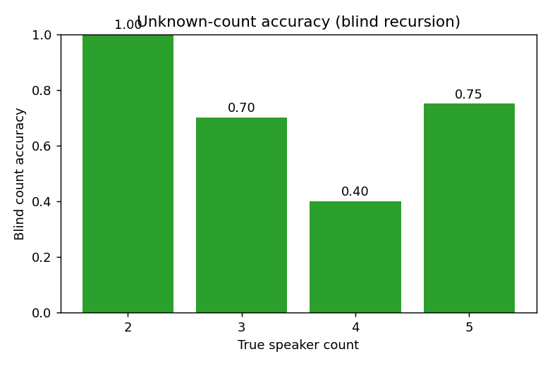
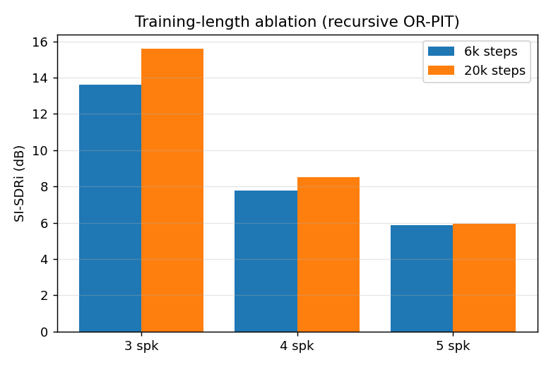

# VoxSplit results summary (Phase 7)

Frozen eval set: LibriSpeech test-clean, 20 mixtures per level, scored at 8 kHz. Metric: SI-SDRi (dB), higher is better.

## Separation quality vs speaker count

| Level | Best fixed-N | OR-PIT recursion (oracle count) | OR-PIT blind (unknown count) |
|---|---|---|---|
| 2 spk | 19.25 (OR-PIT 2-head) | 19.25 | 19.25 |
| 3 spk | 19.33 (pretrained libri3mix) | 15.62 | 16.09 |
| 4 spk | 15.16 (uPIT-4) | 8.50 | 9.09 |
| 5 spk | 11.01 (uPIT-5) | 5.96 | 7.23 |

## Blind unknown-count accuracy

| Level | Count accuracy |
|---|---|
| 2 spk | 1.00 |
| 3 spk | 0.70 |
| 4 spk | 0.40 |
| 5 spk | 0.75 |

## Robustness (2 speakers)

| Condition | Clean-trained | Augmented-robust |
|---|---|---|
| clean | 19.25 | 19.02 |
| WHAM noise | 6.68 | 11.44 |
| reverb | 4.04 | 7.06 |

## Ablations

**Fine-tuning (2-speaker, OR-PIT track).** Warm-start beats pretrained; more steps help until convergence.

| Model | SI-SDRi |
|---|---|
| pretrained wsj02mix | 17.35 |
| OR-PIT 6k | 18.82 |
| OR-PIT 20k | 19.25 |

**In-domain fine-tune does NOT help (3-speaker).** libri3mix is already LibriSpeech-trained.

| Model | SI-SDRi |
|---|---|
| pretrained libri3mix | 19.33 |
| uPIT fine-tune 6k | 18.65 |

**Count/stop classifier training domain** (overall blind count accuracy). Training on the separator's own residuals at multiple depths is what makes blind stopping work.

| Classifier training | Count accuracy |
|---|---|
| clean-trained | 0.25 |
| residual (single-pass) | 0.49 |
| residual (multi-level) | 0.71 |

## Failure analysis

- **4 speakers is the count weak point** (0.40 blind accuracy): three recursion passes accumulate artifacts, so the residual count is hardest to read. Separation is fine once counted right (9.09 dB).
- **More than 5 speakers (untrained regime).** A forced 6-speaker separation still runs but quality collapses to ~3.0 dB mean SI-SDRi (one source near-failed at -12.6 dB); the model was trained on 2-3 speaker mixtures and the field itself degrades hard past 5.
- **Similar voices.** ECAPA discrimination weakens on short, bleed-heavy separated chunks, so same-gender similar-voice long-form conversations mis-stitch and mis-count, while distinct (e.g. mixed-gender) voices stitch cleanly.
- **Reverberation** is the harshest degradation (clean model 4.04 dB); the augmented fine-tune recovers it only partially (7.06 dB).
- **Speech-enhancement post-filter hurts** (MetricGAN+ drops clean SI-SDRi to -0.49 dB); denoisers over-process already-separated speech.

## Plots

